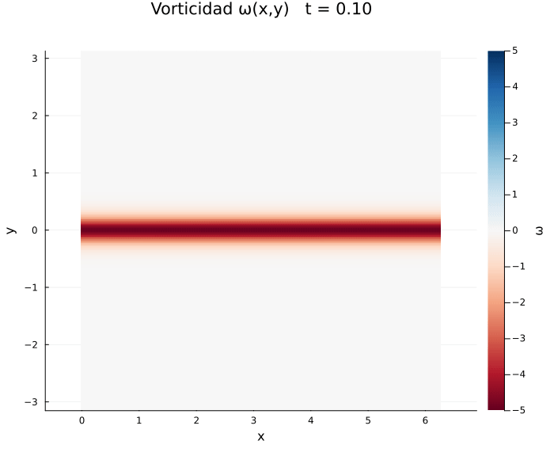

# Simulación de la Inestabilidad de Kelvin–Helmholtz mediante Métodos Pseudo-Espectrales

<p align="center">
  
</p>

## Descripción

Este proyecto implementa una simulación numérica de la inestabilidad de Kelvin–Helmholtz en un fluido bidimensional, incompresible y newtoniano utilizando métodos pseudo-espectrales basados en Transformadas Rápidas de Fourier (FFT).

La formulación empleada se basa en la ecuación de vorticidad–función de corriente, resolviendo la dinámica de la vorticidad sobre un dominio periódico cuadrado.

---

## Fundamento físico

La inestabilidad de Kelvin–Helmholtz aparece cuando existen capas de cizallamiento entre regiones de fluido que se desplazan con velocidades diferentes. Pequeñas perturbaciones en la interfaz pueden amplificarse y dar lugar a la formación de estructuras vorticales características.

Bajo las hipótesis de fluido bidimensional e incompresible,

$$
\nabla \cdot \mathbf{u} = 0,
$$

la evolución de la vorticidad está gobernada por

$$
\frac{\partial \omega}{\partial t} + \mathbf{u}\cdot\nabla\omega = \nu\nabla^2\omega
$$

La función de corriente $\psi$ se obtiene resolviendo

$$
\nabla^2\psi = -\omega.
$$

---

## Método numérico

El código utiliza:

- Método pseudo-espectral basado en FFT.
- Derivadas espaciales calculadas en espacio espectral.
- Evaluación del término no lineal en espacio físico.
- Regla de dealiasing 2/3.
- Integración temporal mediante Runge–Kutta de cuarto orden (RK4).
- Resolución espectral de la ecuación de Poisson para la función de corriente.

---

## Características

- Simulación de la evolución temporal de la vorticidad.
- Estudio del efecto de la viscosidad.
- Cálculo de energía cinética y enstrofía.
- Exportación de diagnósticos temporales.
- Generación de animaciones y visualizaciones.
- Comparación de distintos regímenes viscosos.

---

## Dependencias

El proyecto requiere Julia y los siguientes paquetes:

```julia
using FFTW
using Plots
using DelimitedFiles
using LinearAlgebra
using Statistics
```

Instalación:

```julia
using Pkg

Pkg.add("FFTW")
Pkg.add("Plots")
```

---

## Ejecución

Ejecutar el archivo principal:

```bash
julia kelvin_helmholtz.jl
```

Los parámetros principales que pueden modificarse son:

- Resolución espacial (`Nx`, `Ny`)
- Paso temporal (`dt`)
- Tiempo total de simulación (`T`)
- Viscosidad cinemática (`ν`)
- Amplitud de la perturbación inicial (`ϵ`)

---

## Resultados

El código permite analizar:

- Formación de vórtices Kelvin–Helmholtz.
- Evolución de la energía cinética.
- Evolución de la enstrofía.
- Influencia de la viscosidad sobre la dinámica del flujo.
- Aproximación al régimen invíscido para viscosidades pequeñas.
- Con el archivo ```analisis_energia.jl``` en ```resultados\``` puedes visualizar una comparación entre la energía y/o la enstrofía en diferentes casos. 

---

## Referencias

1. Canuto, C., Hussaini, M. Y., Quarteroni, A., & Zang, T. A. *Spectral Methods in Fluid Dynamics*.
2. Orszag, S. A. (1971). *Elimination of aliasing in finite-difference schemes*.
3. Drazin, P. G., & Reid, W. H. *Hydrodynamic Stability*.
4. McNally, C. P., Lyra, W., & Passy, J. C. (2012). *A Well-Posed Kelvin–Helmholtz Instability Test and Comparison*.

---

## Autor

**Pedro Damian Meneses Orozco**  
Facultad de Ciencias, Universidad Nacional Autónoma de México (UNAM)
